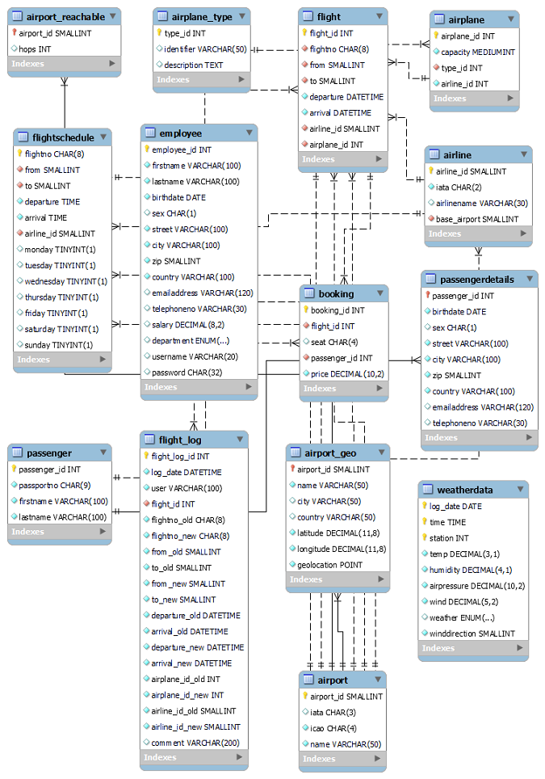

# MySQL.com example datasets

These are 4 example datasets available at [MySQL.com Example Datasets](https://dev.mysql.com/doc/index-other.html)
 - [Sakila](https://dev.mysql.com/doc/sakila/en/)
 - [World](https://dev.mysql.com/doc/world-setup/en/)
 - Menagerie
 - [Airport](https://dev.mysql.com/doc/airportdb/en/)

## Download

```
  ./get-data.sh
```
## Installation

```
  export AUTHENTICATION="-u<user> -p<password> -h<host>"
  ./load-data.sh
```

If you wish to use a docker container implementation that was created for examples within this repos See [Docker Setup](../DOCKER.md).
```
  source .db.cnf
  export DOCKERIZE="docker exec -i ${DB_CONTAINER}"
  export AUTHENTICATION="-u<user> -p<password> -h<host>"
  ./load-data.sh
```  

## Data Distribution

The airportdb is the largest dataset including:

- 113 airlines
- 9,854 airports
- 462,553 flights
- 36,095 passengers
- 54,304,619 bookings

The DB structure via https://dev.mysql.com/doc/airportdb/en/airportdb-structure.html




## Example SQL for datasets

* [Airport DB Stats Queries](airport-db/20-stats.sql)
* [Airport DB General Queries](airport-db/30-queries.sql)
